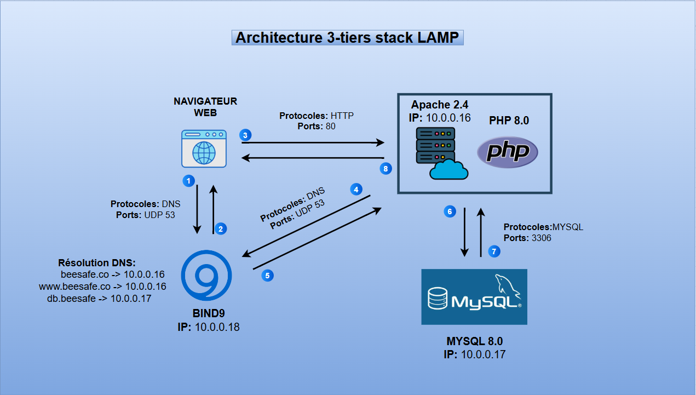

# Projet 03 — Architecture 3-Tier

## Objectif
Mettre en place une **architecture 3-tiers** afin de séparer les différentes couches d'une application et améliorer la **sécurité, la performance et la maintenabilité**.

## Architecture du projet

L'infrastructure repose sur trois couches distinctes :

- **Présentation (Web Server)** : interface utilisateur
- **Application (Application Server)** : traitement de la logique applicative
- **Base de données (Database Server)** : stockage des données

## Schéma d’architecture

---

## Étapes de réalisation

- Mise en place de **trois serveurs distincts**
- Configuration du **serveur Web**
- Déploiement du **code source php**
- Installation et configuration de la **base de données**
- Installation et configuration du **dns (bind9)**
- Configuration de la **communication entre les trois tiers**
- Tests de fonctionnement de l'application

## Aperçu technique

* [Voir Code source](./Code_source)
* [Voir Configuration DNS](./Configuration_DNS)
* [Voir Configuration Apache](./Configuration_apache)
## Stack technique

- **Linux**
- **Apache**
- **MySQL**
- **php**
