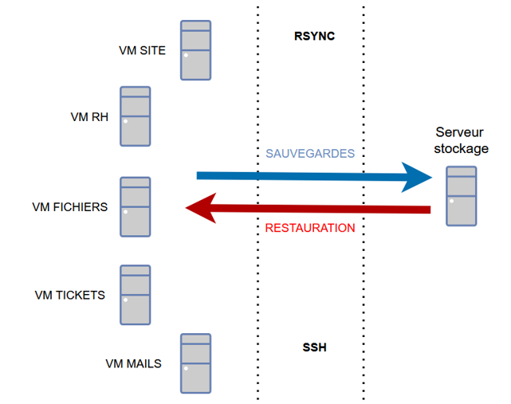

# Projet 05 — Stratégies de sauvegarde et restauration avec rsync

## Objectif
Mettre en place une solution de **sauvegarde et restauration automatisée** à l'aide de **rsync**, avec différentes stratégies adaptées aux besoins de l'infrastructure.

Les sauvegardes et restaurations sont exécutées depuis chaque serveur métier vers le serveur de sauvegarde.

Deux stratégies de sauvegarde ont été mises en place :

- **Sauvegarde incrémentale par domaine métier**
  - RH
  - IT
  - etc.

- **Sauvegarde différentielle par machine virtuelle**

Les sauvegardes sont automatisées via **cron**.

## Schéma infrastructure

## Étapes de réalisation

- Analyse du besoin et définition de la **stratégie de sauvegarde**
- Mise en place de **scripts de sauvegarde avec rsync**
- Configuration des **options rsync adaptées**
- Planification des sauvegardes avec **cron**
- Génération de **logs de sauvegarde et restauration**
- Mise en place d'une **procédure de restauration**
  
## Stack technique

- **Linux**
- **rsync**
- **bash**
- **cron**
