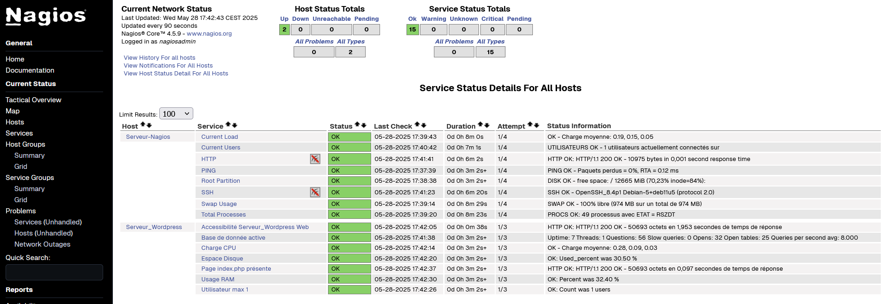

# Projet 06 — Supervision système avec Nagios & centralisation des logs

## Objectif
Mettre en place une solution de **supervision et de centralisation des logs** pour surveiller un serveur WordPress.

Le serveur **Nagios** joue également le rôle de **serveur central Rsyslog** afin de collecter les logs du serveur web.

## Architecture

- **Serveur Web WordPress**
- **Serveur de supervision Nagios**
- **Centralisation des logs avec Rsyslog**

## status sondes nagios

 
## Étapes de réalisation

- Installation d’un **serveur Linux avec WordPress**
- Installation et configuration de **Nagios**
- Mise en place de la **supervision du serveur WordPress**
- Supervision du **serveur Nagios**
- Mise en place de la **centralisation des logs avec Rsyslog**
- Collecte des logs Apache sur le serveur Nagios

## Stack technique

- **Linux**
- **Nagios**
- **Rsyslog**
- **Apache / WordPress**
- **VirtualBox**
