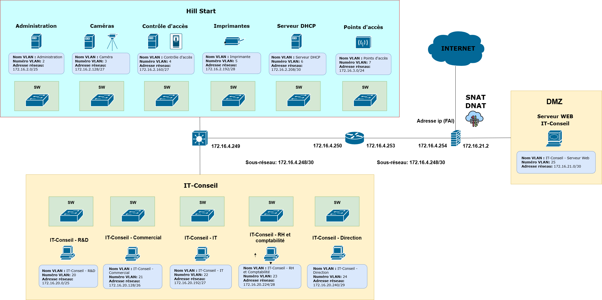

# Projet 06 — Conception d’une architecture réseau

## Objectif
Concevoir l'architecture réseau d’un système d'information en définissant :

- le **schéma physique du réseau**
- le **schéma logique avec segmentation VLAN**
- le **plan d’adressage IP**

## Schéma Logique

## Stack technique

- **Réseaux TCP/IP**
- **VLAN**
- **Plan d’adressage IP**
- **Conception d’infrastructure réseau**
