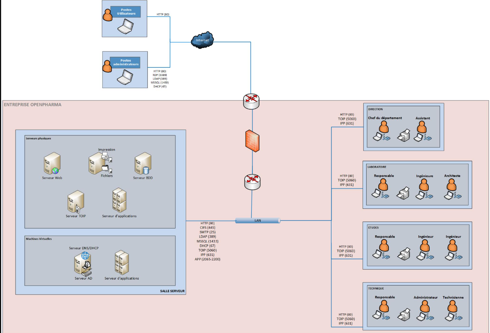

# Projet 10 — Sécurisation d’une infrastructure SI (ANSSI)

## Objectif
Redessiner et sécuriser l’architecture du système d’information d’un département R&D en suivant les **recommandations de l’ANSSI**.

Le projet comprend :

- une **nouvelle cartographie réseau sécurisée**
- un **plan projet de sécurisation**
- une **documentation pour administrateurs et utilisateurs**
  
## Architecture sécurisée

La nouvelle architecture met en place :

- une **DMZ** pour isoler les services exposés
- un **bastion d'administration**
- un **VPN sécurisé pour les administrateurs**
- une **segmentation réseau avec VLAN**
- un **switch Layer 3 pour le routage inter-VLAN**
- un **SIEM pour la journalisation**
- un **serveur de sauvegarde**

 ## Ancienne cartographie :

## nouvelle cartographie :

Le réseau est segmenté en plusieurs VLAN (Direction, Laboratoire, Études, Technique, Services, Administration).

## Documentation sécurité

Une documentation destinée aux **administrateurs et utilisateurs** a été rédigée.

Elle couvre notamment :

- gestion des comptes et des privilèges
- principe du **moindre privilège**
- mots de passe robustes
- journalisation des actions d’administration
- procédures de connexion sécurisée

Par exemple, les administrateurs doivent utiliser **des comptes dédiés et nominatifs**, distincts de leurs comptes utilisateurs.

## Stack technique

- Architecture réseau sécurisée
- VLAN
- VPN (OpenVPN)
- Bastion d'administration
- SIEM
- Firewall
- ANSSI Security Guidelines
